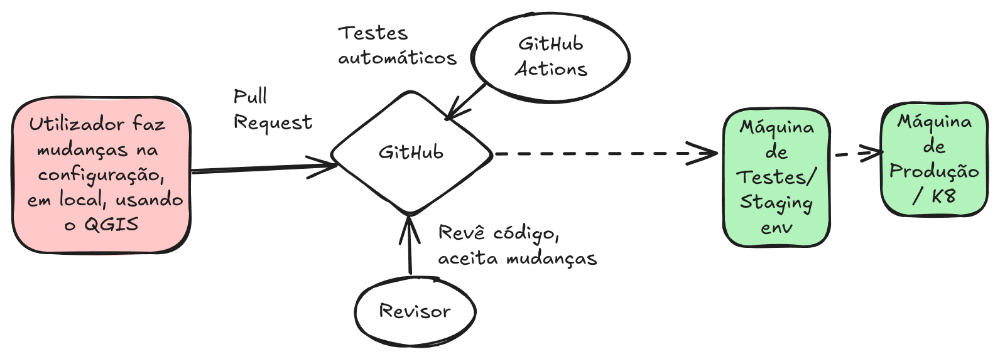

# README.md

This repository holds the [configuration file of pygeoapi](./docker.config.yml). This file is integrated into a pipeline of ingestion, as shown in the diagram bellow.

## Quick Start :rocket:

1. Clone this repository with: `git clone https://github.com/byteroad/pygeoapi-config.git`, or using a Git tool.
2. Update the file using a text editor, or using the [`pygeoapi_config` QGIS plugin](https://github.com/byteroad/pygeoapi_config).
3. Commit the updated file to this repository. This will trigger the [automated tests](https://github.com/byteroad/pygeoapi-config/actions/) and notify reviewers, for manual review.
4. After the file is reviewed and merged, it will be used on the next steps of the pipeline, which take place outside this repository.

## License

This project is released under an [MIT License](./LICENSE)

(dev-exercise-template)